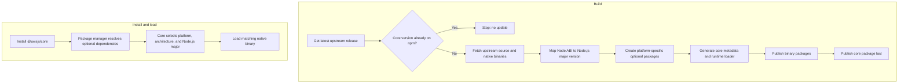

# uwsjs

NPM distributions of [uWebSockets.js](https://github.com/uNetworking/uWebSockets.js/tree/binaries), published as a core package and platform-specific native binary packages.

## Install

```bash
npm install @uwsjs/core
```

`@uwsjs/core` declares the binary packages as optional dependencies. The package manager installs the compatible binary for the current platform, architecture, and supported Node.js major version.

## Supported Targets

- Node.js 22, 24, and 26
- Linux: x64 and arm64 (glibc)
- macOS: x64 and arm64
- Windows: x64

See [published packages](https://www.npmjs.com/org/uwsjs) for the available builds. The API follows the upstream [uWebSockets.js declarations](https://github.com/uNetworking/uWebSockets.js/blob/binaries/index.d.ts).

## Project Flow



## Development

```bash
bun run build
bun run release
```

`bun run build` fetches the latest upstream release and generates the binary and core packages under `packages/`. `bun run release` publishes packages in dependency order, with core last.